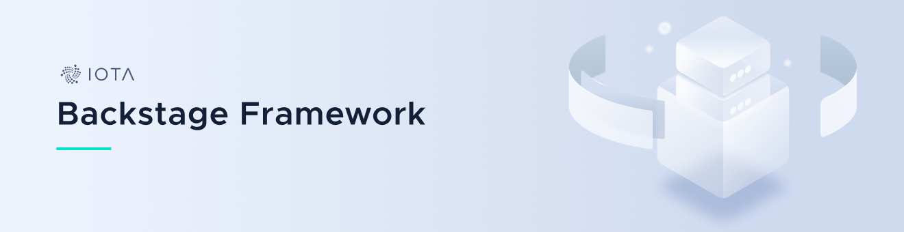

<h1 align="center">
  <br>
  <a href="#"></a>
</h1>

<h3 align="center">A framework for building data-driven distributed systems</h2>

<p align="center">
    <a href="https://docs.iota.org" style="text-decoration:none;">
    
</p>
<p align="center">
    <a href="https://github.com/iotaledger/backstage/actions" style="text-decoration:none;"></a>
    <a href="https://github.com/iotaledger/backstage/actions" style="text-decoration:none;"></a>
    <a href="https://discord.iota.org/" style="text-decoration:none;"></a>
    <a href="https://iota.stackexchange.com/" style="text-decoration:none;"></a>
    <a href="https://github.com/iotaledger/backstage/blob/master/LICENSE" style="text-decoration:none;"></a>
    <a href="https://dependabot.com" style="text-decoration:none;"></a>
</p>

<p align="center">
  <a href="#about">About</a> ◈
  <a href="#prerequisites">Prerequisites</a> ◈
  <a href="#getting-started">Getting started</a> ◈
  <a href="#supporting-the-project">Supporting the project</a> ◈
  <a href="#joining-the-discussion">Joining the discussion</a> ◈
  <a href="#future-work">Future work</a> ◈
  <a href="#LICENSE">LICENSE</a>
</p>

---

## About
Backstage is an actor-model framework which seeks to make distributed and fair processing simple. Actors can be defined as individual modules and be combined to form fully-fledged applications. For examples, see [scylla.rs](https://github.com/iotaledger/scylla.rs) and [chronicle.rs](https://github.com/iotaledger/chronicle.rs), which are built using Backstage.

NOTE: Backstage is currently under heavy development to improve its usability. It is not yet recommended to use in production environments as breaking changes will be frequent in the near future.
## Prerequisites
Actors are best used across multiple parallel processing units, thus it is recommended that applications built with Backstage are run on machines with multiple cores.

## Getting started
Actors are defined by four Subtraits: `Name`, `Init`, `EventLoop`, `Terminating`. With the exception of `Name`, these act like lifetime hooks. Each can fail and return a `Need`, which indicate how the actor's supervisor should handle the failure.

An actor's supervisor is simply another actor which has been defined to manage it. This can include spawning, aborting, and interop. Communication occurs via the supervisor handle provided in each of the lifetime trait functions. This handle can be anything, but safe communication across threads is usually performed via message channels.

In order to define an application comprised of various actors, Backstage provides a `launcher!` macro:

```
launcher!(builder: AppsBuilder {[] -> HelloWorld: HelloWorldBuilder, [] -> Howdy: HowdyBuilder}, state: Apps {});
```

This macro consumes a builder and state (a data struct used by the builder to construct the launcher) and defines a struct which holds that data. By implementing `Builder` for this struct you can define how the launcher actor builds each of its dependencies. Then, to start the launcher, invoke the builder:

```
// Create the launcher `Apps` by invoking `AppsBuilder::build()`
let apps = AppsBuilder::new().build();
// Start the launcher
apps.HelloWorld().await.Howdy().await.start(None).await;
```

## Supporting the project

If you want to contribute to Backstage, consider posting a [bug report](https://github.com/iotaledger/backstage/issues/new?template=bug-report-for-backstage.md), [feature request](https://github.com/iotaledger/backstage/issues/new?template=feature-request-for-backstage.md) or a [pull request](https://github.com/iotaledger/backstage/pulls).

Please read the following before contributing:

- [Contributing guidelines](.github/CONTRIBUTING.md)

## Joining the discussion

If you want to get involved in the community, need help with getting set up, have any issues related to Backstage, or just want to discuss IOTA, Distributed Registry Technology (DRT) and IoT with other people, feel free to join our [Discord](https://discord.iota.org/).

## Future work

- Simplify actor creation using proc macros
- Unify Actor traits into one
- Remove `launcher!` macro and replace it with something more simple and reliable
- Add more examples and documentation
- Add unit tests

## LICENSE

(c) 2021 - IOTA Stiftung

IOTA Chronicle is distributed under the Apache License (Version 2.0).
